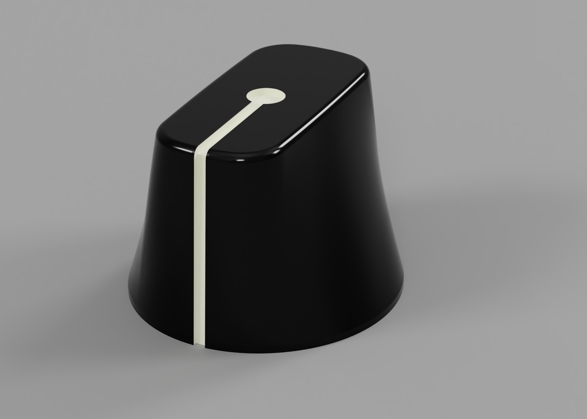

# 3d printable knob for pidp11
This repository contains 3D models for printing replica PDP11/70 rotary selector knobs designed for the PiDP11.

I created this 3D model after purchasing and putting together an excellent [PiDP-11 kit](https://obsolescence.wixsite.com/obsolescence/pidp-11) which is based on the open source emulator [SimH](https://github.com/simh/simh) running on a Raspberry Pi.

While the kit is great, the rotary selector knobs do not match the original PDP-11/70's iconic design. These knobs were modeled from photographs of real-world PDP-11/70 front panels. They have been scaled down to fit the replica PiDP-11 kit. Because they are a recreation based on photos, the geometry may be different than the original designs.

3D rendering of the model:

**3D printing**: I printed this on a Prusa i3 MK2S using Prusament PLA filiment.

**Painting**: I painted them using glossy black acrylic with white acrylic for the line. A steady hand or careful masking is needed to ensure the line is painted straight.

**Assembly**: Hand tapped using a M2-0.40 tap and assembled using M2-0.40 grub screws. This hole could be drilled larger if smaller grub screws are not available.

This work is licensed under the Creative Commons Attribution-ShareAlike 3.0 United States License. To view a copy of this license, visit http://creativecommons.org/licenses/by-sa/3.0/us/ or send a letter to Creative Commons, PO Box 1866, Mountain View, CA 94042, USA.
